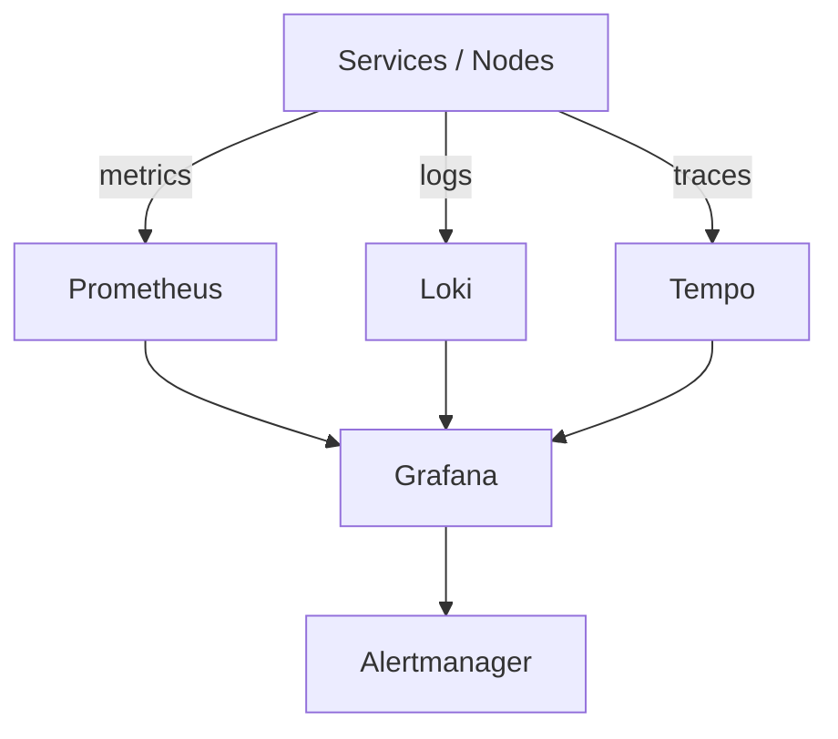
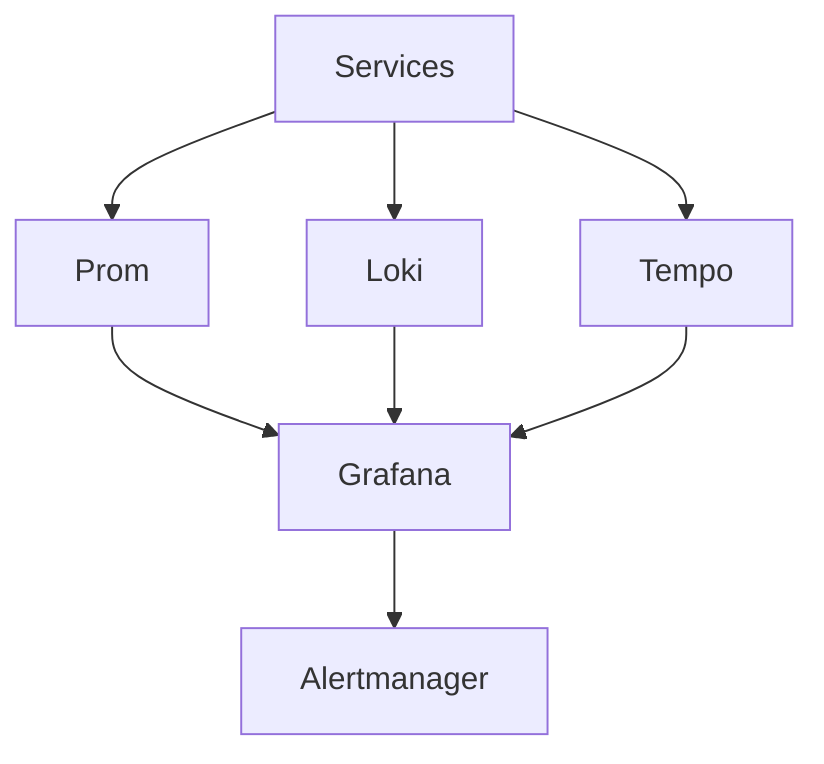

# platform-observability

Blockchain infrastructure observability stack delivering unified metrics, logs, and traces using Prometheus, Loki, Tempo, Grafana, and Alertmanager for reliable detection and response.


**Overview** | [Architecture](#architecture) | [Features](#features) | [Deployment](#deployment) | [Monitoring](#monitoring) | [Security](#security) | [Screenshots](#screenshots)

## Problem Statement

Blockchain nodes and supporting services generate high-volume metrics, logs, and traces. Without unified collection and visualization, operators cannot correlate issues across layers, detect anomalies early, or maintain SLAs for validators and RPC endpoints.

## Solution

Pre-configured Docker Compose stack wires Prometheus (metrics + scrape), Loki (logs), Tempo (traces), Grafana (unified dashboards), and Alertmanager. Volume mounts and prometheus.yml provide production-like local setup. Patterns extend to Kubernetes deployments.

## Features

- Prometheus with custom scrape config (prometheus.yml)
- Grafana with admin default and datasource wiring
- Loki for log aggregation
- Tempo for distributed tracing
- Alertmanager integration
- Docker Compose local demo with persistence
- Kubernetes deployment patterns and runbooks

## Technology Stack

- **Metrics**: Prometheus
- **Logs**: Loki
- **Traces**: Tempo
- **Dashboards/Alerts**: Grafana + Alertmanager
- **Packaging**: Docker, Compose
- **Orchestration**: Kubernetes (patterns in docs)

## Architecture



### Component Breakdown

- **Ingress**: Published ports (9090 prom, 3000 grafana, 3100 loki, 3200 tempo, 9093 alertmanager)
- **Service**: Container services with targets; k8s Services in prod
- **Storage**: Bind mounts for prometheus.yml, grafana data, loki/tempo volumes
- **Monitoring**: Self-scraping + unified Grafana UI across signals + Alertmanager
- **Deployment flow**: `docker compose up`; k8s manifests or Helm in production

<details>
<summary>Show observability-stack.mmd</summary>


</details>

## Repository Structure

```
platform-observability/
├── docker-compose.yml          # prom + grafana + loki + tempo + alertmanager
├── prometheus.yml              # scrape config
├── diagrams/observability-stack.mmd
├── screenshots/                # observability-stack.png, metrics-flow.png, dashboard-overview.png, alert-routing.png
├── docs/                       # runbook.md, troubleshooting.md
├── Dockerfile
├── SECURITY.md
├── .github/workflows/ci.yml    # validate + docker build
└── ROADMAP.md
```

## Screenshots

### Observability Stack


### Metrics & Dashboards


### Alerts & Routing


## Deployment

```bash
git clone https://github.com/blockmalhotra/platform-observability
cd platform-observability
docker compose up
# Grafana: http://localhost:3000 (admin / admin)
```

See docs/runbook.md for production k8s patterns.

## Monitoring

- Prometheus scrapes targets via prometheus.yml
- Grafana unifies metrics, logs (Loki), traces (Tempo)
- Alertmanager routes alerts from rules
- Self-monitoring of the stack itself

## Security

- No real credentials in compose (admin default noted for demo only)
- Volume mounts limit scope
- See SECURITY.md and docs for RBAC/secrets patterns in k8s

## CI/CD

`.github/workflows/ci.yml`:

- validate: `docker compose config --quiet`
- build: docker validation build

## Roadmap

### Completed

- Core stack Compose (Prometheus, Grafana, Loki, Tempo, Alertmanager)
- prometheus.yml scrape configuration
- Architecture diagram and initial CI
- v0.1.0-in-progress tag and portfolio standardization

### In Progress

- Recruiter documentation and cross-portfolio consistency
- Runbook and troubleshooting references

### Planned

- Expanded Grafana dashboards and alert rules
- Kubernetes Helm/Operator packaging
- Production scaling and retention tuning

## Lessons Learned

- Volume mounts for config (prometheus.yml) and data are essential for reproducible local vs prod parity.
- Unified Grafana view across metrics/logs/traces dramatically reduces mean time to correlation during incidents.
- Alertmanager routing must be tuned early; default config hides signal in noise for blockchain workloads.

## License

MIT License. See [LICENSE](LICENSE).

---

**Reference implementation and learning project. Not production deployment.**
