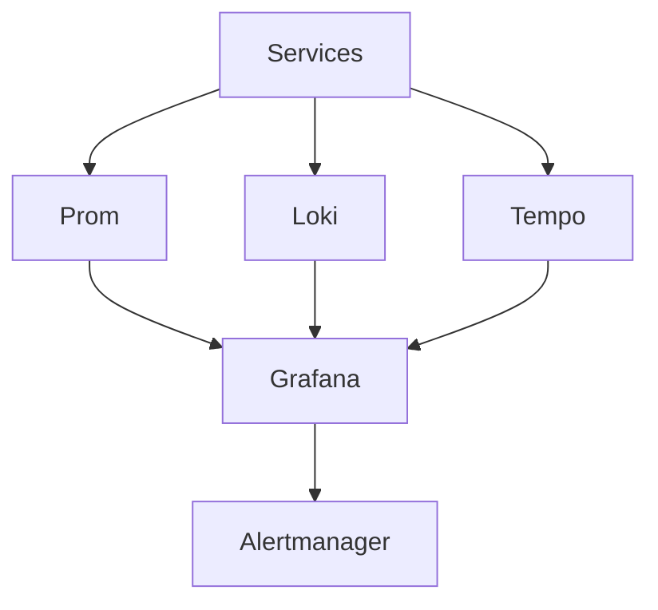

# platform-observability

🚧 Status: In Progress

This repository is currently under active development.
It represents a reference implementation and learning project.
Features and architecture may change before stable release.


## Features

- Full observability stack: Prometheus, Grafana, Loki, Tempo, Alertmanager
- Metrics, logs, traces for blockchain infra
- Docker compose demo with volume mounts
- Production k8s patterns and runbooks

## Architecture



### Component Breakdown

- **Ingress**: Port mappings in compose (9090 prom, 3000 grafana, 3100 loki, 3200 tempo, 9093 alert)
- **Service**: Container services with scrape targets; k8s Service when deployed
- **Storage**: Bind mounts for prom.yml, grafana data, loki/tempo persistence
- **Monitoring**: Self-monitoring + Grafana unified UI for metrics/logs/traces + Alertmanager
- **Deployment flow**: docker compose up (demo); k8s manifests or helm in prod for full stack

## Quick Start

```bash
git clone https://github.com/blockmalhotra/platform-observability
cd platform-observability
docker compose up
# Grafana: http://localhost:3000 (admin/admin)
```

## Roadmap

### v0.1
- Initial release

### v0.2
- Feature expansion

### v0.3
- Production hardening

### v1.0
- Stable release

## Contributing

See CONTRIBUTING.md

## License

MIT License - see LICENSE file.

## Problem
Blockchain infrastructure requires production patterns for deployment, monitoring, routing and secrets.

## Components
- Docker compose for local demo
- Kubernetes manifests (StatefulSet, Service, ConfigMap, Secret)
- Observability (Prometheus, Grafana, Loki, Tempo)
- GitOps ready

## Monitoring
Prometheus metrics, Grafana dashboards, logs and traces via Loki/Tempo.

## Security
No real credentials. Secrets use CHANGEME or valueFrom. RBAC, no keys in images.

## CI/CD
.github/workflows/ci.yml: validate (compose), build (docker).

## Troubleshooting
See docs/troubleshooting.md
