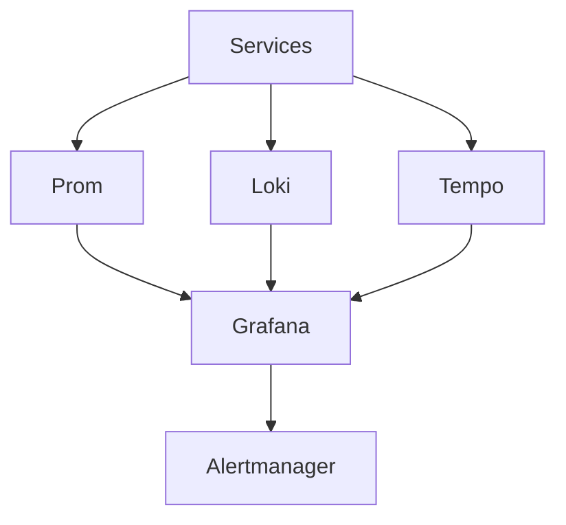

# platform-observability

Enterprise Observability Stack.

## Problem
Blockchain infra needs unified observability for metrics, logs, traces to detect issues early.

## Architecture

## Components
Prometheus, Grafana, Loki, Tempo, Alertmanager.

## Quick Start
docker compose up

## Demo
See docker-compose.yml

## Screenshots
screenshots/observability-stack.png etc.

## Monitoring
Dashboards, alerts.

## Security
No secrets in compose.

## CI/CD
.github/workflows/ci.yml

## Production Deployment
k8s, persistent volumes.

## Roadmap
- More panels

## Runbooks
docs/runbook.md

## Troubleshooting
docs/troubleshooting.md
