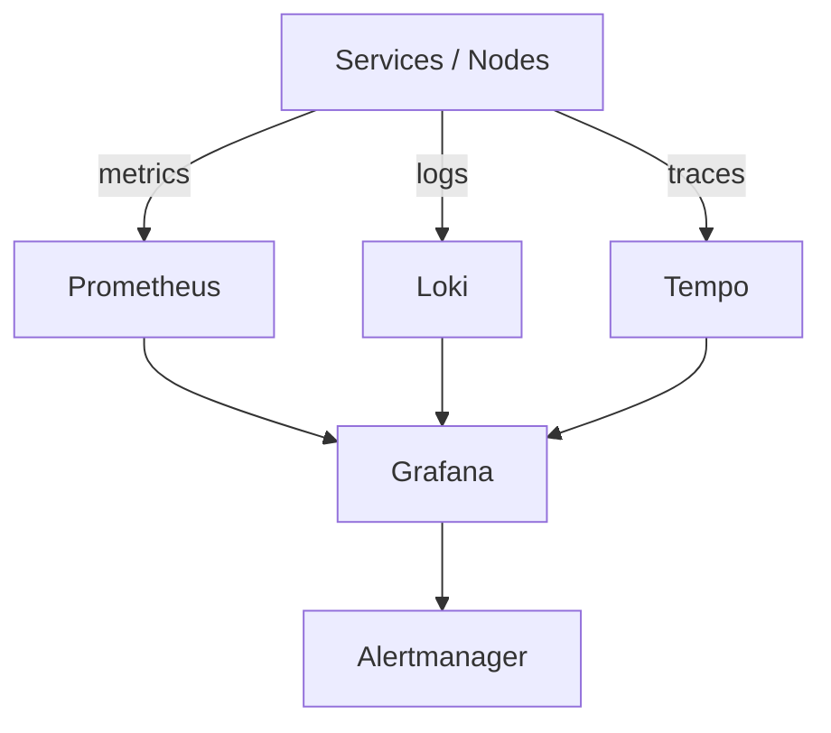

# platform-observability

<p align="center">

**Production-inspired Blockchain Infrastructure Observability Stack demonstrating Prometheus, Loki, Tempo, Grafana, Alertmanager, and unified metrics/logs/traces patterns.**

</p>


## Professional Summary

Pre-configured Docker Compose stack for blockchain nodes and services: Prometheus (metrics + scrape), Loki (logs), Tempo (traces), Grafana (unified dashboards), Alertmanager. Volume mounts and prometheus.yml for local prod-like setup. Patterns extend to Kubernetes. Demonstrates full-signal observability for validators, RPC, and supporting infrastructure.

## Table of Contents

- [Problem Statement](#problem-statement)
- [Why This Exists](#why-this-exists)
- [Solution Overview](#solution-overview)
- [Key Features](#key-features)
- [Architecture](#architecture)
- [Technology Stack](#technology-stack)
- [Repository Structure](#repository-structure)
- [Deployment Workflow](#deployment-workflow)
- [Monitoring & Observability](#monitoring--observability)
- [Security Considerations](#security-considerations)
- [Operational Lessons Learned](#operational-lessons-learned)
- [Screenshots](#screenshots)
- [Roadmap](#roadmap)
- [Business Impact](#business-impact)
- [Resume Relevance](#resume-relevance)
- [License](#license)

## Problem Statement

Blockchain nodes and supporting services generate high-volume metrics, logs, and traces. Without unified collection and visualization, operators cannot correlate issues across layers, detect anomalies early, or maintain SLAs for validators and RPC endpoints.

## Why This Exists

Node operators and RPC providers need reliable signals for uptime, performance, and errors. Siloed tools (metrics only or logs only) slow incident response. This provides a ready-to-run reference for full-signal observability in blockchain infrastructure.

## Solution Overview

Compose wires Prometheus with custom scrape (prometheus.yml), Grafana, Loki, Tempo, and Alertmanager. Volume mounts for config and data. Self-monitoring + unified UI. Kubernetes deployment patterns in docs for production.

## Key Features

- Prometheus with custom scrape config (prometheus.yml)
- Grafana with admin default and datasource wiring
- Loki for log aggregation
- Tempo for distributed tracing
- Alertmanager integration
- Docker Compose local demo with persistence
- Kubernetes deployment patterns and runbooks

## Architecture



### Component Breakdown

- **Ingress**: Published ports (9090 prom, 3000 grafana, 3100 loki, 3200 tempo, 9093 alertmanager)
- **Service**: Container services with targets; k8s Services in prod
- **Storage**: Bind mounts for prometheus.yml, grafana data, loki/tempo volumes
- **Monitoring**: Self-scraping + unified Grafana UI across signals + Alertmanager
- **Deployment flow**: `docker compose up`; k8s manifests or Helm in production

## Key Engineering Decisions

- Volume mounts for prometheus.yml and data dirs keep local dev config identical to production scrape targets (docker-compose.yml and prometheus.yml).
- Unified Grafana as single pane for metrics (Prom), logs (Loki), traces (Tempo) to speed correlation (compose services).
- Alertmanager wired last in pipeline to avoid noise until signals are stable.

## Production Considerations

- Default Grafana admin password in compose must be changed via env or secret in real clusters.
- Retention and scrape intervals in prometheus.yml require tuning for node scale.
- Loki/Tempo storage backends need persistent volumes in prod (not in demo compose).

## Technology Stack

- **Metrics**: Prometheus
- **Logs**: Loki
- **Traces**: Tempo
- **Dashboards/Alerts**: Grafana + Alertmanager
- **Packaging**: Docker, Compose
- **Orchestration**: Kubernetes (patterns in docs)

## Repository Structure

```
platform-observability/
├── docker-compose.yml          # prom + grafana + loki + tempo + alertmanager
├── prometheus.yml              # scrape config
├── diagrams/observability-stack.mmd
├── screenshots/                # observability-stack.png, metrics-flow.png, dashboard-overview.png, alert-routing.png
├── docs/                       # runbook.md, troubleshooting.md
├── Dockerfile
├── SECURITY.md
├── .github/workflows/ci.yml    # validate + docker build
└── ROADMAP.md
```

## Deployment Workflow

```bash
git clone https://github.com/blockmalhotra/platform-observability
cd platform-observability
docker compose up
# Grafana: http://localhost:3000 (admin / admin)
```

See docs/runbook.md for production k8s patterns.

## Monitoring & Observability

- Prometheus scrapes targets via prometheus.yml
- Grafana unifies metrics, logs (Loki), traces (Tempo)
- Alertmanager routes alerts from rules
- Self-monitoring of the stack

## Security Considerations

- No real credentials in compose (admin default for demo only)
- Volume mounts limit scope
- See SECURITY.md and docs for RBAC/secrets patterns in k8s

## Operational Lessons Learned

- Volume mounts for config (prometheus.yml) and data essential for reproducible local vs prod parity.
- Unified Grafana view across metrics/logs/traces reduces mean time to correlation during incidents.
- Alertmanager routing must be tuned early; defaults can hide signal in blockchain noise.

## Screenshots

### Observability Stack


### Metrics & Dashboards


### Alerts & Routing


## Roadmap

### Completed

- Core stack Compose (Prometheus, Grafana, Loki, Tempo, Alertmanager)
- prometheus.yml scrape configuration
- Architecture diagram and initial CI
- v0.1.0-in-progress tag and portfolio standardization

### In Progress

- Recruiter documentation and cross-portfolio consistency
- Runbook and troubleshooting references

### Planned

- Expanded Grafana dashboards and alert rules
- Kubernetes Helm/Operator packaging
- Production scaling and retention tuning

## Business Impact

Enables early detection of node and service issues through correlated signals. Reduces downtime for validators and RPC by providing unified visibility. Standardizes observability patterns across blockchain infrastructure teams. Supports faster incident response and SLA maintenance.

## Resume Relevance

This repository demonstrates practical experience with:

- Observability Pipelines (metrics, logs, traces)
- Monitoring & Alerting (Prometheus, Grafana, Loki, Tempo, Alertmanager)
- Kubernetes Operations (deployment patterns, volume mounts)
- Infrastructure Standardization (Compose to k8s)
- Production Troubleshooting (runbooks, self-monitoring)
- DevOps Tooling (Docker, Compose, CI validation)

## License

MIT License. See [LICENSE](LICENSE).

---

Reference implementation. Evidence from repository code and manifests only.
